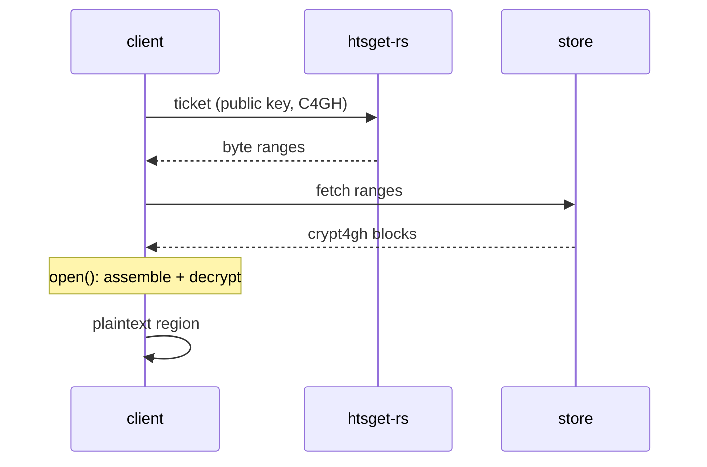

# Client-side support for encrypted htsget streams

Date: 2026-06-12

## Problem

The htsget client in `modos.genomics.htsget` streams genomic regions by
fetching a ticket of byte ranges and concatenating them into a single stream.
The [htsget-rs](https://github.com/umccr/htsget-rs) server can serve
crypt4gh-encrypted streams, but the client cannot yet decrypt them (we only
do crypt4gh on *local* files, in `modos.genomics.c4gh`).

## Server protocol (htsget-rs, experimental)

The client sends a `Client-Public-Key: <base64 crypt4gh public key>` header and
an `encryptionScheme=C4GH` query parameter. The server returns byte ranges that
concatenate into a valid crypt4gh file (header re-encrypted to that public key,
plus edit lists). The client decrypts the assembled stream with the matching
private key.

The `encryptionScheme=C4GH` parameter is experimental and subject to change.

## Decisions

- User inputs: A `--secret-key` path (plus optional passphrase). The
  public key is derived from it if possible.
- **Surface:** both the CLI `modos stream` and the Python API
  (`HtsgetConnection` / `MODO.stream_genomics`).
- **Output:** decrypt transparently; the user gets the plaintext region.

## Approach

Decrypt at the `HtsgetConnection.open()` boundary: when a secret key is set,
`open()` returns a decrypted readable and every consumer (CLI, `to_pysam`,
`to_file`) is unchanged. The encrypted stream is buffered to a temp file before
decryption (consistent with `to_pysam`, which already spools).

Rejected: decrypting in each consumer (duplication, leaks encryption awareness);
a lazy streaming-decrypt wrapper (crypt4gh has no clean incremental reader).

## Flow

## Out of scope

- Server-side / deployment configuration of htsget-rs C4GH.
- Encrypting or decrypting remote objects at rest (client-side only).
