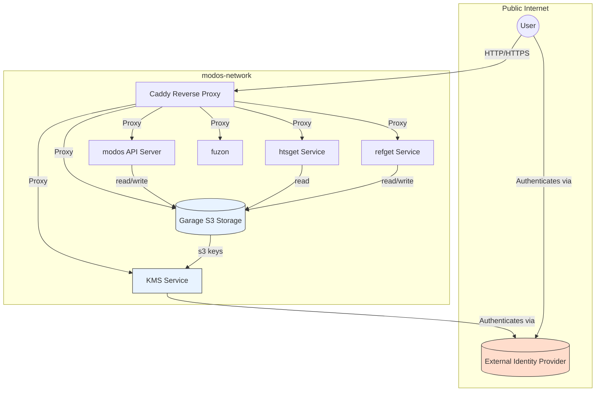

# MODOs Deployment Stack

This directory contains instructions for serving and managing a modos deployment stack. The stack is modular, secure, and designed for both local development and production deployments.

---

## Overview

The deployment uses Docker Compose to orchestrate the following core services. For each service, a link with additional documentation is available:

- [**Caddy**](caddy/README.md): Reverse proxy and gateway, routing HTTP(S) traffic to services.
- [**Garage**](garage/README.md): S3-compatible object storage for MODOs and reference data.
- [**modos-server**](modos-server/README.md): FastAPI application providing REST endpoints for listing, querying, and retrieving MODO metadata.
- [**htsget**](htsget/README.md): Genomic data streaming server (e.g., for CRAM/BAM/BCF slices).
- [**refget**](refget/README.md): Reference sequence server, providing hash-based access to reference data [WIP].
- [**fuzon**](fuzon/README.md): Terminology code matching service.
- [**kms**](kms/README.md): Key Management Service for issuing temporary S3 credentials and integrating authentication (OIDC).

All services are connected via a Docker bridge network and exposed through Caddy on standard HTTP/HTTPS ports.

---

## Architecture


---

## Endpoints

All endpoints are accessible via the Caddy gateway (default: `http://localhost`):

| Path             | Service         | Description                                 |
|------------------|----------------|---------------------------------------------|
| `/s3/*`          | Garage         | S3-compatible object storage API            |
| `/htsget/*`      | htsget         | Genomic data streaming                      |
| `/refget/*`      | refget         | Reference sequence access                   |
| `/fuzon/*`       | fuzon          | Terminology code matching                   |
| `/kms/*`         | kms            | Key management, authentication              |
| `/list`          | modos-server   | List available MODOs                        |
| `/meta`          | modos-server   | Retrieve metadata for all MODOs             |
| `/get`           | modos-server   | Query MODOs by name (with optional fuzzy)   |
| `/`              | modos-server   | Service status and endpoint discovery       |

---

## Configuration

All configuration is handled via environment variables. **Do not edit the `.example.env` directly.**
Instead, copy it to `.env` and adjust as needed:

```sh
cp .example.env .env
# Edit .env to set secrets, bucket names, endpoints, etc.
```

Variables with `LOCAL` (e.g. `FUZON_LOCAL_URL`) represent addresses used by services to communicate with each other. Variables with `PUBLIC` (e.g. `FUZON_PUBLIC_URL`) represent addresses used by clients to communicate with services.

> One exception to this is the htsget service, which access S3 via its public address.


LOCAL addresses default to the service names, while PUBLIC addresses point to the reverse proxy route for the service. When externalizing a service, both LOCAL and PUBLIC addresses can be overridden.

---

## Deployment

### 1. Prepare Environment

- Copy `.example.env` to `.env` and edit as needed.
- Ensure Docker and Docker Compose are installed.

### 2. Start the Stack
```sh
just deploy
```

This will build and start all services for local development (using the `local` compose profile). Caddy will listen on ports 80 (HTTP) and 443 (HTTPS, if configured).

### 3. Upload MODOs

- Use the modos CLI to create and upload MODOs to the Garage S3 bucket.
- Reference and data buckets are defined in your `.env`.
- Default S3 credentials should be configured in your .env

### 4. Access Services

- All endpoints are available via `http://localhost` (or your configured domain).
- Use the modos CLI or REST API to interact with the server.

---

## Authentication & Production Use

- By default, authentication is **disabled** for ease of development. This means that all services are accessible, and that S3 can be accessed with standard S3 credentials (by exporting them as environment variables).
- For production, set up an OIDC provider (only Authentik is tested and supported) and configure:
  - `OIDC_ISSUER_URL`
  - `AUTH_CLIENT_NAME`
  - `AUTH_URL`
  - `AUTH_TOKEN`
- Caddy can be configured for forward authentication to protect all endpoints with authentication, with the exception of S3, for which forward authentication should not be enabled. Instead, temporary S3 credentials are used to access it.
- **Change all default credentials and secrets in your `.env` before going live.**
- Expose only necessary ports and use HTTPS for all external traffic.

---

## Advanced Configuration

- You can point any service to an external S3 endpoint by setting the appropriate `*_PUBLIC_URL` and `*_LOCAL_URL` in `.env`.
- For custom domains or HTTPS, adjust the Caddyfile and environment variables accordingly.
- For scaling or custom deployments, each service can be run independently.
