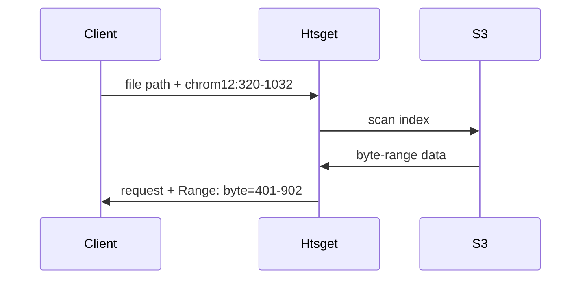

# Htsget

Htsget is a tool for streaming genomics data over the network. On the client side, it can interoperate with standard tools such as samtools.

On the server side, it reads data from S3 and keeps an index mapping genomic coordinates to byte-ranges on S3.

It is important that the htsget service has read access to all the data on S3.

Htsget needs to access S3 via its public address, as it does not directly forwards data to the client. Instead, it crafts specific S3 requests with byte-range headers corresponding to specific genomic queries and sends them to the client.

The client then directly queries the S3 server with those requests.

