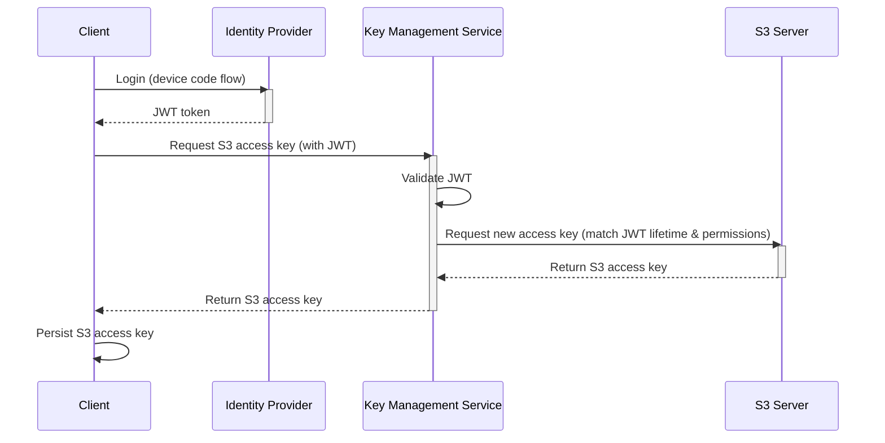

# Key Management Service (KMS)

The kms coordinates the identity provider and S3 server to issue temporary S3 credentials that correspond to JWT tokens delivered by the identity provider.

This allows the client to transparently request and refresh those credentials as long as it has a valid JWT from the identity provider.

>[!IMPORTANT]
> The KMS is only required when authentication is needed. To enable it, use `docker compose --profile auth [...]`. It requires an external identity provider to function, and only supports authentik and garage S3.

